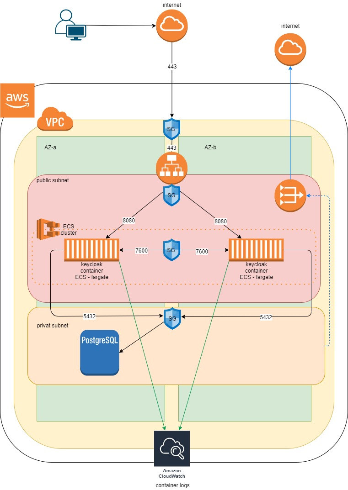

# This repo covers CloudFormations templates to install and configure keycloak service with postgreSQL db on AWS cloud using AWS resources (VPC, subnets, LB, ECS-fargate, postgreSQL db..)  

  

## Disclaimer

This is only for testing purpose with mainly focus on CloudFormation infrastructure concept templates and less on content of keycloak container  

  

## Infrastructure diagram

  
## Prerequisites

- AWS account
- Uploaded/created ACM certificate

  
## Usage/Steps

**Step 1**: Create stack (recommended name because of referencing: **network**) by uploading '**`step1-network.yaml`**' file

It will create resources:

-	VPC – included IP ranges depend (mappings) on environment choice (**parameters**)
-	2 (for each availability zone) Public/Private subnets under created VPC - included IP ranges depend (mappings) on environment choice (prod, dev)
-	Internet gateway for VPC
-	Public/Private routing tables
-	NAT gw with Elastic IP for private subnet internet gateway
-	Outputs for cross-stack reference

**Step 2**: Create stack (recommended name because of referencing: **db**) by uploading '**`step2-db.yaml`**' file

It will create resources:

-	RDS PotgreSQL DB instance – with included default parameters -> pay attention to environment choice (regarding to previous step env choice)
-	DB security group – allowing access to 5432 port only from public subnets (both zones)
-	DB subnet group – creates subnet group from private subnets
-	Outputs for cross-stack reference and access data which will be needed in **step 5**

**Step 3**: Create stack (recommended name because of referencing: **lb**) by uploading '**`step3-lb.yaml`**' file

It will create resources:

-	Public LB security group for access to public LB
-	Public HTTPS LB -> needs pre-created certificate ARN (prerequisite) 
-	Dummy target group – it's need and we still don't have created real targets (provided in **step 5**)
-	Public listener
-	Public redirect (http to https) listener
-	Outputs for cross-stack reference

**Step 4**: Create stack (recommended name because of referencing: **ecs**) by uploading '**`step4-ecs_cluster.yaml`**' file

It will create resources:

-	ECS cluster – needed for ECS service (provided in **step 5**)
-	ESC security group with ingress for access to ECS containers from public LB and internal ECS connection
-	IAM role (ECSRole) – permissions needed for ECS networking (interfaces and LB) and also for Docker container to change load balancer target group to new pointing (containers)
-	IAM role (ECSTaskExecutionRole) – allows Docker containers to create logs
-	Outputs for cross-stack reference

**Step 5**: Create stack (recommended name because of referencing: **service**) by uploading '**`step5-service.yaml`**' file -> pay attention to empty parameters which need to be filled out with output access data (stack db – **step 2**)

It will create resources:

-	CloudWatch log group – needed for task definition which will send container logs to CloudWatch
-	Target group for LB
-	LB listener rule
-	ECS task definition – need for ECS container definition (resources, image, portmappings, env variables..)
-	ECS service –  connects LB to ECS task definition and puts docker containers to public subnets
